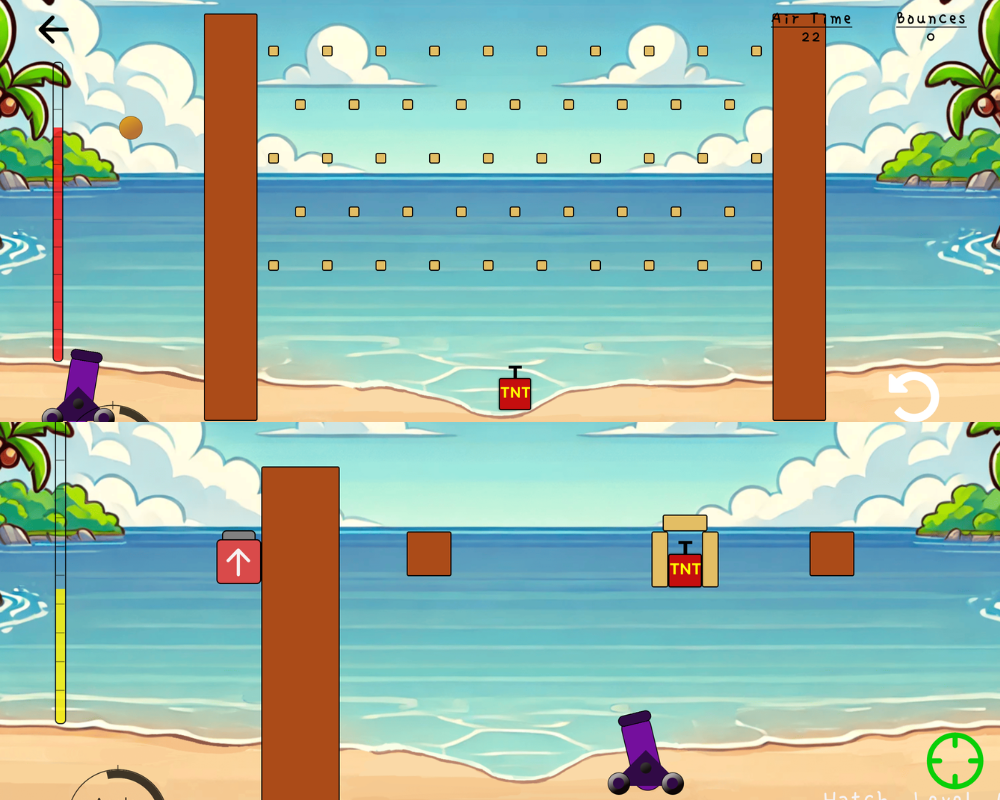

# Cannon Ball Sea

**Cannon Ball Sea** is a fun and exciting mobile game where you aim to hit the TNT handle to create explosive reactions! With 45 challenging levels, the game tests your precision, strategy, and ability to overcome obstacles. Use points earned from successful shots to upgrade your cannon and cannonballs to help you conquer each level and collect stars along the way!

## Features

- **45 levels** of increasing difficulty, each with unique obstacles and challenges.
- Upgrade your **cannon** and **cannonballs** using the points you earn to improve your performance.
- Fun and engaging **explosive effects** when hitting the TNT handle.
- Collect **stars** by completing levels with high scores.
- **Responsive design** for smooth gameplay on mobile devices.
- **SQLite** integration to save game progress and scores.

## How to Play

1. **Aim** your cannon and **fire** to hit the TNT handle.
2. Overcome **obstacles** in each level to reach the TNT.
3. Earn **points** by successfully hitting the TNT and complete the levels.
4. Use points to **upgrade** your cannon and cannonballs.
5. Complete all 45 levels and collect **all stars**!
6. Find the game here: https://apps.apple.com/us/app/cannon-ball-sea/id6736433554

## Technologies Used

- **React Native** for cross-platform mobile development.
- **SQLite** for saving game data and progress.